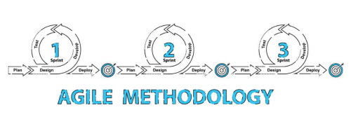
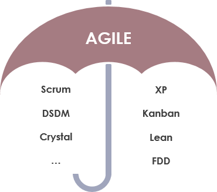
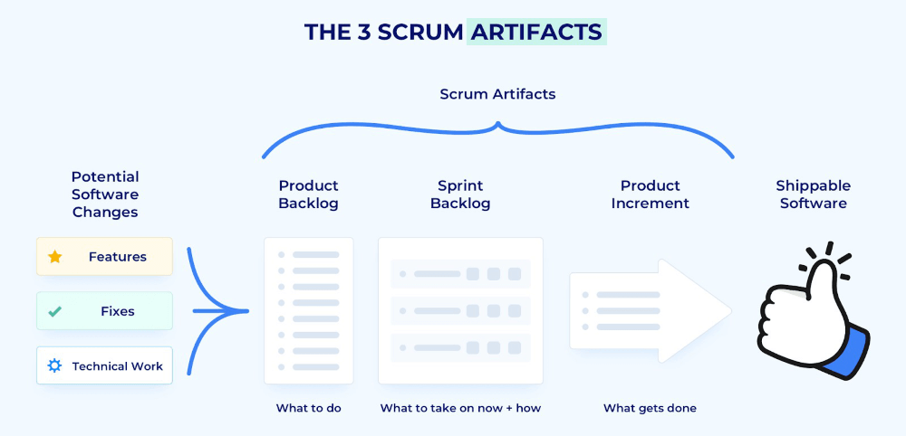
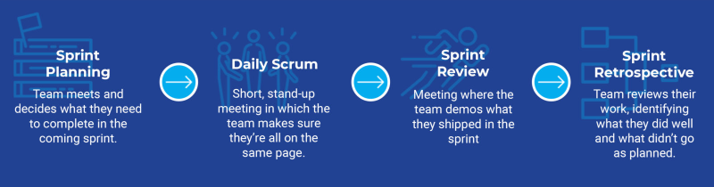

# agile methodologies Interview Questions

Q. What is agile?

 
 Answer 

Agile is an approach or mindset for project management and software development. Emphasis is placed on incremental software development. Adapt and respond to change as products and requirements change. Agile is used as a flexible approach to meet the strengths of traditional Waterfall methods.

---

Q. How does Agile differ from the traditional Waterfall methodology?

 
 Answer 

- Agile emphasizes adaptability and participation. Plan waterfall prices in advance.
- Agile is an incremental and iterative approach. Waterfall is a linear and continuous approach.
- Agile splits projects into sprints. The waterfall divides the project into phases.
- Agile helps with small projects. A lot to accomplish The waterfall helps complete the project.
- Agile introduces product thinking with a focus on customer satisfaction. Waterfall introduces project thinking with a focus on successful project delivery.
- In Agile, requirements are ready every day, whereas in Waterfall, requirements are ready only once from the start.
- Agile allows requirements to change at any time. Waterfall avoids scope changes at the beginning of a project.
- Testing with Agile Development The testing phase occurs after the waterfall construction phase.
- In Agile, the testing team can be involved in changing the requirements. In Waterfall, the testing team is not involved in changing the requirements.
- Agile allows the entire team to manage a project without a dedicated project manager. Waterfall requires a project manager who plays a key role in each step.

---

Q. What are some potential drawbacks of using an Agile methodology?

 
 Answer 

- Agile is easy to understand in theory. But it's hard to do well in practice. It takes real commitment and the first attempt is unlikely to go well.
- The fact that Agile requires very little implementation in the beginning. This makes it easy to be overlooked at the same time. and providing new and unexpected functionality
- Agile requires more time and energy from everyone. This is because developers and users (i.e. product owners) communicate continuously.
- There may be fewer blueprints for what the final deliverable will be. This can make it difficult to gain commitment to the project from stakeholders at an early stage.
- Agile can be challenging when it comes to supplier-customer relationships. Customers generally want to know what they are getting for their money as quickly as possible.
- Agile can be very challenging for large projects or where coexistence is not possible. (between developers and businesses)
- Agile methods often require rapid changes from one side of the project to the other. This leaves little time for proper documentation of each step. Record keeping is important. But this is often a disadvantage of agile working methods.
- Features that are too large to fit in a single or multiple frames may be avoided. Because it doesn't fit the view.

---

Q. what is Scrum?

 
 Answer 

Scrum is an agile framework for developing, delivering, and sustaining software products and services. Although since its inception Scrum has gained popularity in other areas such as research, sales, marketing, and high tech…

The Scrum framework is designed for teams of 10 people or less. It breaks down work into goals that can be completed in time-boxed iterations, called Sprints, lasting no more than a month. Mostly for two weeks, a Scrum team with a 15 minute time box … tracks progress in a daily meeting, called the Daily Scrum, at the end of the sprint. The team reviews sprints and retrospectives to show work done and make continuous improvements.

---

Q. Are agile or scrum is the same thing ?

 
 Answer 

No, agile is a philosophy or mindset for project management and software development. Scrum is a framework for agile project management. Scrum is an agile framework for developing, delivering, and sustaining software products and services. Although since its inception Scrum has gained popularity in other areas such as research, sales, marketing, and high tech…

---

Q. What is a Scrum Sprint ?

<detiails> 
 Answer 

A sprint is a time-boxed period of time in which a scrum team works to complete a set of goals. The sprint is the heart of Scrum. It is the only way to deliver value to the customer.

---

Q. What are the 3 Scrum Artifacts ?

 
 Answer 

1. **Product Backlog**

   - The product backlog is a list of all the features and functionality that a product must have. It is constantly evolving and is never complete.

2. **Sprint Backlog**

   - The sprint backlog is a list of all the features and functionality that must be completed during the sprint. It is a subset of the product backlog. It is created during the sprint planning meeting. During this negotiation, the ScrumMaster should work with the Development Team and Product Owner to try to find ways to create some smaller increment of an item rather than drop it altogether.

3. **Prouduct Increment**

   - The product increment is the sum of all the completed features and functionality that have been completed during the sprint. It is the result of the sprint. It is the only thing that can be delivered to the customer.

   
   <detalils>

---

Q. What are the 4 scrum events or ceremnoies ?

 
 Answer 

1. **Sprint Planning Meeting**

   - The sprint planning meeting is a meeting where the Scrum Team and Product Owner come together to plan the sprint. The ScrumMaster should work with the Development Team and Product Owner to try to find ways to create some smaller increment of an item rather than drop it altogether. The Product Owner describes the objective of the Sprint and also answers questions from the Development Team about execution and acceptance criteria / criteria of satisfaction. The development team has the final say in how much of the high-priority work it can accomplish during the Sprint.

2. **Daily Scrum Meeting**

   - The daily scrum meeting is a 15-minute meeting where the Scrum Team meets to discuss the progress of the sprint. They describe for each other how their own work is going, ask for help when needed, and consider whether they are still on track to meet the Sprint Goal. This is not a status meeting but is instead an opportunity for the Development Team to inspect and adapt the product and process on a daily basis.

3. **Sprint Review Meeting**

   - Sprint reviews focus on the product being developed, specifically on the potentially shippable product increment created during the sprint. During a sprint review, the Scrum Team invites stakeholders to discuss what was completed during the Sprint. They adapt the Product Backlog as needed based on this feedback. The Product Owner has the option to release any of the completed functionality. Though a demo might be part of this meeting, the primary purpose of the Sprint Review is the inspect and adapt capability provided by the discussion.

4. **Sprint Retrospective Meeting**

   - The Sprint Retrospective Meeting is a meeting where the Scrum Team discusses what went well during the sprint, what did not go well, and how to improve the process for the next sprint. The Scrum Master is responsible for ensuring the meeting is held and that the team follows the agenda. The Scrum Master should ensure that the team is not critical of each other and that the team is focused on the process and not the people.

     

---

Q. What is the role of Scrum Master in Scrum team ?

 
 Answer 

The Scrum Master is accountable for a scrum Team's effectiveness. They focus on coaching the team members in self-management and cross-functionality, eliminating impediments to the team's progress and shielding them from outside interference, and making sure that all scrum events and ceremonies take place and are positive, productive, and kept within the alloted time.

In addition to working with team members, scrum masters also work with project owners as well as stakeholders to ensure that everyone understands and follows scrum practices and is clear about what the team is working on and what the objectives are.

---

Q. What is a Sprint Burnout chart ?

 
 Answer 

Sprint burndowns are a graphical way of showing how much work is remaining in the sprint, typically in terms of task hours. It is typically updated at the daily scrum. As the sprint progresses, the amount of work remaining should steadily decrease and should trend toward being complete on the last day of the sprint. Burndowns that show increasing work or few completed tasks are signals to the Scrum Master and the team that the sprint is not going well. Sprint burndown charts helps teams gauge whether they will complete the work of a sprint. Burndown charts also reinforce the Scrum values of commitment, focus and openness and one of the three pillars of empirical process control: transparency.

